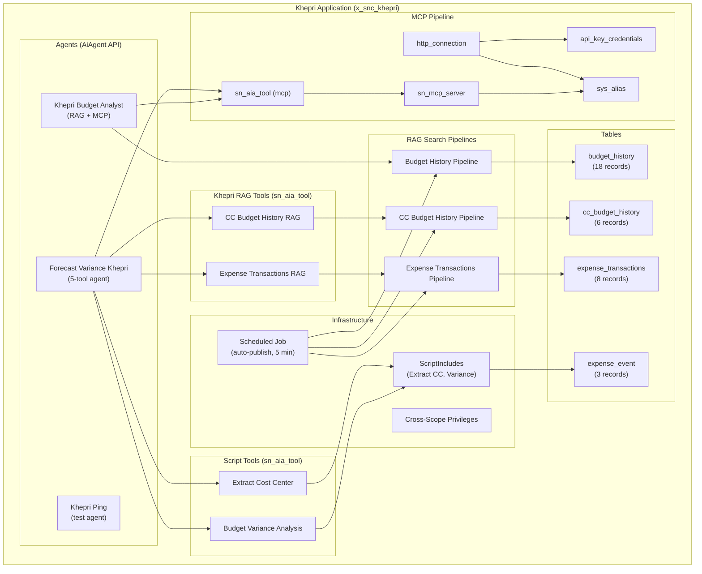
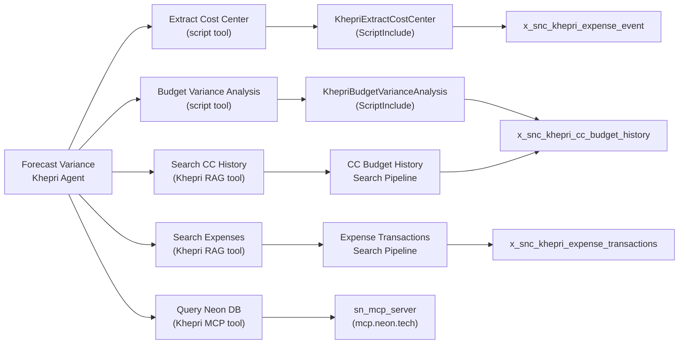
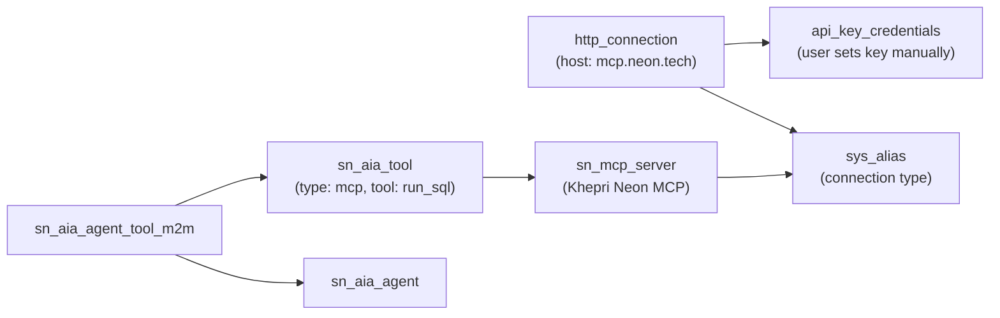
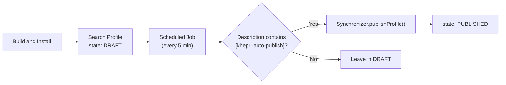
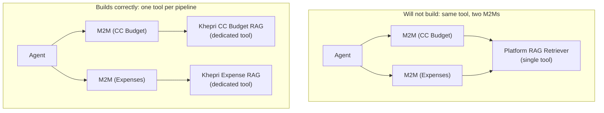
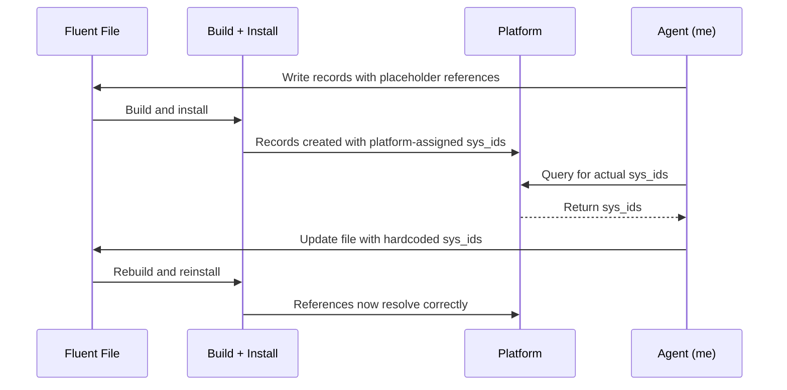
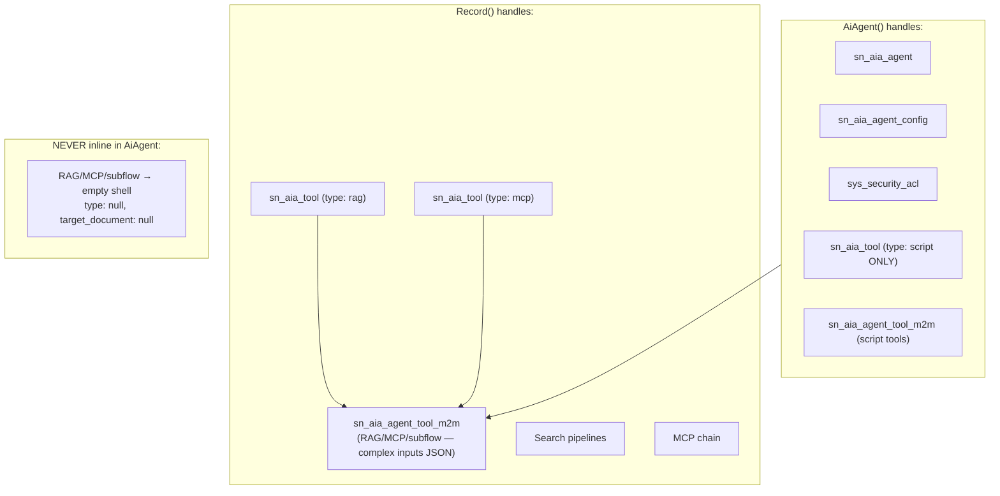

# Khepri

Khepri is an experimental ServiceNow scoped application (`x_snc_khepri`) that proves an AI coding agent, operating through the Now SDK Fluent DSL, can programmatically create fully functional AI Agents with RAG search pipelines, MCP connections, and multi-tool orchestration. No manual UI interaction required.

Named after the Egyptian scarab god who rolls the sun into existence each morning. Khepri rolls agents into existence from code.

> **Instance**: `<YOUR_INSTANCE>.service-now.com`
> **Scope**: `x_snc_khepri` | **SDK**: Fluent 4.6.0

---

## Premise

This effort is NOT testing whether the AI coding agent understands ServiceNow or can reason about application architecture. That is assumed and can be tested separately.

**What we ARE proving**: the agent's ability to _create_ the ServiceNow metadata objects that make up a working AI Agent through this interface. Tables, seed data, search pipelines, MCP connections, tool definitions, agent wiring.

Khepri contains the building block objects for creating AI Agents in ServiceNow, assembled from real use cases. The number and variety of objects will increase as more use cases are built with it.

All objects are created from scratch in Khepri scope. Zero cross-scope dependencies.

---

## Table of Contents

1. [What Khepri Does](#what-khepri-does)
2. [Architecture](#architecture)
3. [What Was Built](#what-was-built)
4. [Key Learnings and Constraints](#key-learnings-and-constraints)
5. [File Inventory](#file-inventory)
6. [Agent Playbook](#agent-interaction-protocol) — points to `AGENT_PLAYBOOK.md`
7. [Open Items](#open-items)
8. [Quick Links](#quick-links)

---

## What Khepri Does

Khepri demonstrates that a coding agent operating through the Now SDK Fluent DSL can:

1. **Create AI Agents** using the native `AiAgent()` Fluent API, which handles agent, agent config, ACL, and optionally tools in one declaration.
2. **Build RAG search pipelines from scratch**: table with seed data, AIS datasource, **datasource field attributes** (`ais_datasource_field_attribute` — maps fields to `title`/`text` roles for indexing), search source, search profile, **search application** (`sys_search_context_config` — connects profile to the AI Search engine), profile-source M2M, dedicated RAG tool (`sn_aia_tool` type: rag), and agent tool M2M wiring. After install, user must manually trigger indexing from AI Search Admin Console.
3. **Auto-publish search profiles** via a scheduled job that targets only opt-in profiles tagged with `[khepri-auto-publish]`.
4. **Create MCP connections** (API key auth only): credential, HTTP connection, sys_alias, sn_mcp_server, sn_aia_tool (type: mcp), agent tool M2M.
5. **Create script-based tools** with ScriptIncludes as the backing logic, replacing subflow dependencies entirely. Tool scripts use the IIFE pattern `(function(inputs) { return result; })(inputs);` — the only pattern that works in `sn_aia_tool` script context.
6. **Build a complete 5-tool agent** (2 script tools, 2 RAG pipelines, 1 MCP) with every component created in Khepri scope.

---

## Architecture

### High-Level Component Map



### Forecast Variance Khepri: Tool Map

All 5 tools created from scratch in Khepri scope.



### MCP Connection Chain



### Auto-Publish Flow



---

## What Was Built

### Phase 1: Agent creation

**Goal**: Prove we can create an `sn_aia_agent` programmatically.

**Result**: Success. Created "Khepri Ping" test agent with a custom script tool.

**Learning**: Cross-scope privileges must be declared for tables owned by other scoped apps (e.g. `sn_aia`). Global-scope tables generally do not need explicit privileges.

### Phase 2: RAG search pipeline

**Goal**: Create a complete AI Search pipeline from table with seed data, through AIS datasource/source/profile, to wiring a RAG tool to an agent.

**Result**: Success.

Key discoveries:

- **Search profile publishing**: Profiles created via Record API land in `DRAFT` state. They must be published via `sn_ais.Synchronizer.publishProfile()` to become active. The install process uses `setWorkflow(false)`, which skips business rules, so a business rule cannot handle this.

- **Auto-publish via scheduled job**: Created a scheduled script (every 5 minutes) that scans for profiles tagged with `[khepri-auto-publish]` in their description field and publishes them. Profiles without the tag stay in DRAFT.

- **Datasource field attributes are required for indexing**: Publishing a profile makes it active, but AIS returns no results unless `ais_datasource_field_attribute` records exist on the datasource. Each record maps a table column to a search role: `attribute: f734a634c7320010d1cfd9795cc26094` (content_type), `value: title` for primary fields, `value: text` for body fields. Also requires `ais_datasource_attribute` with attribute `2dd8f14753320010ffaaddeeff7b1293`, value `false`. **DO NOT** use `ais_datasource_semantic_field_m2m` — it is deprecated and does not trigger indexing (confirmed: zero records in `ais_ingest_table_stats`). After install, user must manually trigger indexing from AI Search Admin Console → datasource → Index Now.

- **Search Application (`sys_search_context_config`) is required**: Each search pipeline needs a Search Application record that connects the `ais_search_profile` to the AI Search engine. Without it, RAG search has no engine configuration and returns nothing. One record per pipeline, with `search_engine: ai_search` and `search_profile` pointing to the profile sys_id. All config values must be copied exactly from a working reference: `document_match_threshold: 0.65`, `document_match_count: 3`, `enable_exact_match: true`, `spell_check: true`, `genius_results_limit: 1`, `search_results_limit: 10`, `suggestions_to_show_limit: 10`, `attachment_limit: 5`, `collapse_attachment: true`, `show_tab_counts: true`.

### Phase 3: MCP connections

**Goal**: Programmatically create the full MCP connection chain using only API key authentication.

**Result**: Success. All 6 records in the chain created and correctly linked.

Key discoveries:

- **No cross-scope privileges needed** for `sn_mcp_server`, `sn_aia_tool`, `api_key_credentials`, `http_connection`, or `sys_alias`. Declaring redundant privileges causes a build failure.

- **`Now.ID` does not resolve in Record `data` fields**. When used as a reference value, the literal string is stored instead of the record's sys_id. Requires a two-pass approach: create records first, capture their platform-assigned sys_ids, then update referencing records with hardcoded sys_ids.

- **API keys must be set manually post-install**. The `api_key` field on `api_key_credentials` is `password2` type (encrypted) and cannot be set via `Record()`. This is a **Connection & Credential** record, NOT a sys_property. When building from scratch: (1) create the credential shell with `Record()`, (2) create the `http_connection` with `connection_url` including full protocol (e.g. `https://host/path`), (3) after install, user sets the API key via Connections & Credentials in the platform. Build/install never overwrites an existing credential's `api_key` value.

### Phase 4: Full 5-tool agent from scratch

**Goal**: Build a complete multi-tool agent with all components created in Khepri scope. No reuse of objects from other applications.

**Result**: Success. All 5 tools wired. Several problems were encountered and solved along the way.

**Problem 1: One RAG tool per search pipeline.**
When an agent needs multiple RAG search pipelines, you cannot reuse the single platform RAG Retriever tool for multiple M2M records. The Fluent build validator enforces uniqueness on the `(agent, tool)` pair. Create a dedicated `sn_aia_tool` (type: `rag`, record_type: `custom`) for each pipeline.



**Problem 2: Script tools replace subflows.**
Subflows cannot be created through the Fluent DSL. The solution: create ScriptIncludes with the equivalent logic, then wrap them in `sn_aia_tool` records (type: `custom`) with inline scripts that call the ScriptIncludes. The Budget Variance Analysis ScriptInclude now mirrors the FV subflow exactly: (1) look up budget baseline/actual, (2) look up expense event amount, (3) compute projected variance, (4) determine assessment, (5) create Finance Case on `sn_spend_sdc_service_request`, (6) return results with case number.

**Problem 3: Two-pass reference wiring.**
Search profiles, search sources, RAG tools, and the agent itself all receive platform-assigned sys_ids on first install. Records that reference them (profile-source M2M, tool M2M) need those actual sys_ids. Install once to create records and capture sys_ids, then update the Fluent files with hardcoded sys_ids and reinstall.

### Phase 5: AiAgent API discovery and migration

**Goal**: Resolve a sync failure caused by the Record API approach for agents.

**Background**: The Record API approach for creating `sn_aia_agent` and `sn_aia_agent_config` records stored boolean fields as `"1"`/`"0"` strings. The platform install process accepted this, but the Fluent sync parser could not read them back, crashing with `Cannot coerce value to boolean: undefined`. This blocked all further installs.

**Breakthrough**: The Fluent sync process automatically converted our Record API agent definitions into the native `AiAgent()` Fluent API. This API was undocumented but present in SDK 4.6.0 at `node_modules/@servicenow/sdk/dist/core/servicenow-sdk-aiaf-plugin/`. Reading the type definitions directly revealed:

- `AiAgent()` creates the agent, agent_config, ACL, and optionally tools in one declaration
- `securityAcl` is required, with type `SecurityAclUserAccessConfig` supporting three patterns:
  - `{ $id: Now.ID['...'], type: 'Public' }` for open access
  - `{ $id: Now.ID['...'], type: 'Any authenticated user' }` for auth-required
  - `{ $id: Now.ID['...'], type: 'Specific role', roles: [...] }` for role-restricted
- Tools can be defined inline (the API creates `sn_aia_tool` and `sn_aia_agent_tool_m2m` records automatically)
- Tool types include: `script`, `crud`, `rag`, `mcp`, `subflow`, `action`, `catalog`, `topic`, `capability`, `web_automation`, `knowledge_graph`, `file_upload`

**Result**: All three agents migrated to `AiAgent()`. Boolean coercion issue eliminated. The agents now use a hybrid pattern:

- `AiAgent()` for agent + config + ACL creation (handles booleans correctly)
- `Record()` for tool M2Ms that need complex `inputs` JSON (RAG search config, MCP tool attributes)
- `AiAgent()` inline `tools` array for simple tools (like the Khepri Ping script tool)

This hybrid pattern avoids the duplicate record conflicts that occur when both `AiAgent()` inline tools and `Record()` M2M calls try to create the same records.

---

## Key Learnings and Constraints

### What works

| Capability | How |
|-----------|-----|
| Create AI Agents | `AiAgent()` Fluent API (SDK 4.6.0+) |
| Wire tools to agents | Script tools: inline in `AiAgent()` `tools` array. RAG/MCP/subflow: `Record()` on `sn_aia_agent_tool_m2m` with full inputs JSON. NEVER inline RAG/MCP/subflow — creates empty shells |
| Create RAG tools | `Record()` on `sn_aia_tool` (type: rag) per search pipeline. Must set `target_document` to `sys_one_extend_capability` |
| Create RAG pipelines | `Record()` on `ais_datasource`, `ais_search_source`, `ais_search_profile`, `sys_search_context_config` (Search Application), profile-source M2M, `ais_datasource_field_attribute` (maps fields to `title`/`text` roles — attribute `f734a634c7320010d1cfd9795cc26094`), `ais_datasource_attribute`, `ais_semantic_snippetization_configuration` (PASSAGE mode, 250 word limit, 500 max, 5 overlap), and `ais_semantic_index_configuration` (links datasource to embedding model `c153d0f2432302104611495d9bb8f2ec` + snippetization config). The RAG tool M2M `inputs` JSON MUST include `semantic_index_names` matching the `semantic_field_name` on the index config. **DO NOT** use `ais_datasource_semantic_field_m2m` (deprecated). After install, manually trigger indexing from AI Search Admin Console. |
| Auto-publish search profiles | Scheduled job + `sn_ais.Synchronizer.publishProfile()` + `[khepri-auto-publish]` tag |
| Create MCP connections | `Record()` on `api_key_credentials`, `http_connection`, `sys_alias`, `sn_mcp_server` |
| Create MCP tools | `Record()` on `sn_aia_tool` (type: mcp) with `target_document` pointing to `sn_mcp_server` |
| Create script tools | ScriptInclude + AiAgent inline `tools` array (type: script). Tool script must use IIFE pattern: `(function(inputs) { return result; })(inputs);` — `outputs` is not defined in sn_aia_tool context. Tool runs in app scope, same as ScriptInclude. If the ScriptInclude creates records on cross-scope tables (e.g. Finance Case on `sn_spend_sdc_service_request`), you MUST declare a `CrossScopePrivilege` for `create` on that table — otherwise the insert silently fails. To find the target scope: query `sys_db_object` for the table → get `sys_scope` → query `sys_scope` for the `scope` field value. |

### Agent instructions are not optional

An agent without detailed instructions is an agent that skips tools. The `instructions` field (set via `versionDetails` in the AiAgent API) is the single most important text field on the agent. It tells the LLM exactly which tools to call, in what order, with what inputs, and what to do with the outputs.

Without instructions, the FV Khepri agent called only 2 of 5 tools (Extract Cost Center and Budget Variance Analysis) and skipped the RAG and MCP tools entirely. With the full 4-step instruction set copied from the original agent, it calls all 5.

The `proficiency` field is also important but is not exposed through the AiAgent API. It can be set manually on the instance after install.

**Rule**: When creating agents, always populate instructions with explicit step-by-step tool calling sequences. Never ship an agent with a blank or generic instructions field.

### What does not work (and workarounds)

| Constraint | Cause | Workaround |
|-----------|-------|------------|
| `Now.ID` in Record data fields stores literal strings | Fluent `Now.ID` generates a hash for `$id` but is not resolved when used as a data value | Two-pass: install once to get sys_ids, then hardcode them |
| `password2` fields cannot be set via Record API | Platform security on encrypted fields | Create credential shell; user sets key manually via direct link |
| Business rules skipped during install | Install uses `setWorkflow(false)` | Use scheduled job instead of business rule for post-install logic |
| Duplicate (agent, tool) pairs in M2M rejected | Build validator enforces uniqueness on `(agent, tool)` in `sn_aia_agent_tool_m2m` | Create a dedicated `sn_aia_tool` per search pipeline |
| Record API boolean fields crash the sync | Install accepts `"1"`/`"0"` but sync parser cannot read them back | Use `AiAgent()` API for agents; use `"true"`/`"false"` strings for all other Record API boolean fields |
| AiAgent inline tools conflict with Record M2Ms | Both try to create the same `sn_aia_tool` and `sn_aia_agent_tool_m2m` records | Hybrid: `AiAgent(tools: [script only])` for script tools, `Record()` for RAG/MCP/subflow tool M2Ms |
| AiAgent inline tools create EMPTY SHELLS for non-script types | Inline RAG/MCP/subflow tools produce `sn_aia_tool` with `type: null`, `target_document: null`, no config | NEVER define RAG, MCP, or subflow tools inline. Only `script` type works inline. All others must use Record() M2Ms pointing to pre-existing properly configured tool records |
| AiAgent inline script tools need explicit inputs | Without `inputs` property, inline script tools create `sn_aia_tool` with `input_schema: []` and M2Ms with `inputs: []`. The agent LLM sees no inputs and passes empty `Action Inputs: {}`. | Use the `inputs` property on ScriptToolDetails: `inputs: [{ name: 'event_id', description: '...', mandatory: true }]`. This sets `input_schema` on the tool record durably through code. The SDK type is `ToolInputField[]`. |
| Setting `tools: []` in AiAgent deletes all inline M2Ms | The install treats empty tools array as "remove all inline tools", deleting existing M2Ms | Never set `tools: []` if you have inline tools you want to keep. If you need to move tools from inline to Record() M2Ms, do it in two separate installs: first install removes inline tools, second install creates Record() M2Ms |
| Redundant cross-scope privileges cause build failure | Declaring privileges for tables with open access controls | Only declare privileges for tables that actually restrict access |
| Script tools that create cross-scope records fail silently | ScriptIncludes run in app scope. GlideRecord insert on a cross-scope table returns no error — just no record created. No exception, no log. | Before writing any ScriptInclude, audit every GlideRecord table it touches. For each table NOT in your scope: (1) query `sys_db_object` for the table name → get `sys_scope` sys_id, (2) declare `CrossScopePrivilege` with `targetScope` set to the **scope sys_id** (NOT the scope name string). The Fluent `targetScope` field stores the value as-is — scope name strings like `sn_spend_sdc` do NOT resolve to the sys_id. Always use the 32-char sys_id. To find it: query `sys_scope` → `scope=<name>` → use the `sys_id`. |
| Subflows cannot be created through Fluent | No `sys_hub_flow` support for subflows in the DSL | Use ScriptIncludes wrapped in script-type `sn_aia_tool` records |
| Fluent Flow() creates triggered flows, not callable subflows | `Flow()` requires a trigger; agent tools need callable subflows with string inputs | Create flow via Fluent as scaffold, then manually convert to subflow in Flow Designer: remove trigger, add string inputs, add lookUpRecord, rewire actions |
| Agent subflow tools fail with "Unsupported data type" | Record trigger passes record object; agent passes strings | Subflow must accept string inputs (cost_center, event_id) and lookUpRecord internally |
| `proficiency` field not in AiAgent API | Type definition omits it | Set manually on instance after install |
| Agent security controls (Define user access, Define data access) not in AiAgent API | The AiAgent `securityAcl` property only controls the ACL type (Public, Any authenticated user, Specific role). The full security wizard — "Define user access" and "Define data access" — is not exposed through the Fluent API and must be configured manually on the instance after each install. | After install, open the agent record → Define security controls → set user access and data access. Direct link pattern: `https://<instance>/sn_aia_agent.do?sys_id=<agent_sys_id>` |
| Fluent plugin cannot parse string concatenation | `'a' + 'b'` in property values fails with "Failed to parse property" | Use single string literals with `\n` for multiline |
| `instructions` field not directly on AiAgent | AiAgent API uses `versionDetails` for instructions | Use `versionDetails: [{ name: 'v1', number: 1, state: 'published', instructions: '...' }]` |
| `outputs` is not defined in tool scripts | sn_aia_tool script context has no global `outputs` object | Use IIFE pattern: `(function(inputs) { return result; })(inputs);` Every working tool on the platform uses this pattern. |
| `ais_datasource_semantic_field_m2m` is DEPRECATED | Does not trigger indexing. Working FV app uses zero records from this table. Confirmed by zero entries in `ais_ingest_table_stats`. | Use `ais_datasource_field_attribute` instead: attribute `f734a634c7320010d1cfd9795cc26094`, value `title` or `text`. Also `ais_datasource_attribute` with attribute `2dd8f14753320010ffaaddeeff7b1293`, value `false`. |
| Missing `sys_search_context_config` (Search Application) breaks RAG | Without a Search Application record, the search profile has no engine binding and RAG tools return nothing | Create one `sys_search_context_config` per pipeline: `search_engine: ai_search`, `search_profile: <profile sys_id>`, `document_match_threshold: 0.65`, `document_match_count: 3`, `enable_exact_match: true`, `spell_check: true`, `genius_results_limit: 1`, `search_results_limit: 10`, `attachment_limit: 5`, `collapse_attachment: true`, `show_tab_counts: true`, `enable_semantic_search: false`, `enable_hybrid_search: false`, `hit_highlighting: false`, `show_disabled_facets: false`, `filter_genius_results_by_search_source: false`, `log_signals_server_side: false`, `suggestions_to_show_limit: 10`. |
| Missing `ais_semantic_index_configuration` and `ais_semantic_snippetization_configuration` | Without a semantic index config, the datasource has no embedding index for semantic search. The RAG tool cannot perform vector similarity search. | Create one `ais_semantic_snippetization_configuration` per pipeline: `snippet_mode: PASSAGE`, `limited_by: WORDS`, `limit: 250`, `max_total_words: 500`, `overlap_sentences: 5`. Then one `ais_semantic_index_configuration`: `semantic_field_name` (unique name), `datasource` (table name), `active: true`, `embedding_models: c153d0f2432302104611495d9bb8f2ec`, `semantic_snippetization_configuration` (sys_id of snippet config — requires two-pass wiring). |
| RAG tool M2M missing `semantic_index_names` in inputs JSON | Without this input, the tool doesn't know which semantic index to query | Add `{ name: 'semantic_index_names', label: ['<semantic_field_name>'], value: ['<semantic_field_name>'], description: 'Semantic indexed fields' }` to the `inputs` JSON array. The value must match the `semantic_field_name` on the `ais_semantic_index_configuration` record exactly. |
| Manual indexing required after install | `publishProfile()` activates profile but does NOT trigger data indexing for newly configured datasources | User must go to AI Search Admin Console → select datasource → click "Index Now". Verify via `ais_ingest_table_stats`. |
| MCP chain creates duplicates on each install | `Record()` + `Now.ID` on `api_key_credentials`, `sn_mcp_server` creates new records each build | After install, verify exactly 1 of each MCP record. Delete duplicates. Keep: credential `3bb7a63c...`, mcp_server `547fe996...`. |
| MCP API key is a Connection & Credential record, NOT a sys_property | `api_key_credentials` table, `password2` field (encrypted) | User sets key via platform Connections & Credentials interface. Build/install does NOT overwrite existing credential values — creates empty duplicates alongside. |
| `Record()` cannot update existing records | `Now.ID` generates a new hash each build, so install creates a new record instead of updating | `Record()` is create-only, not upsert. Get every field right on the first install. For `http_connection`, always include `connection_url` with full protocol (e.g. `https://mcp.neon.tech/mcp`). For any record, check the table schema (`get_table_schema`) and populate all required/functional fields before first install. |
| `Record()` with `Now.ID` creates duplicates on every install | `Now.ID` generates a new hash each build; platform doesn't match to existing record | After first install, hardcode platform-assigned sys_ids into `Record()` calls. Always verify record counts after install. Delete inactive/conflict duplicates manually. |
| Auto-publish job skipped already-published profiles | Original filter `state != PUBLISHED` meant semantic field changes after publish were never re-indexed | Removed state filter — job now always re-publishes tagged profiles. `publishProfile()` is idempotent and forces re-index. |

### Two-pass pattern for cross-table references

When records reference each other across tables:

```
Pass 1: Create records -> Platform assigns sys_ids
Pass 2: Read sys_ids -> Update Fluent file with hardcoded values -> Reinstall
```



### AiAgent + Record hybrid pattern



---

## File Inventory

```
src/
  fluent/
    index.now.ts                                Barrel file
    agents/
      khepri-test-agent.now.ts                  Khepri Ping agent (AiAgent API)
      forecast-variance-khepri.now.ts           FV Khepri agent (AiAgent API)
      fv-khepri-tools.now.ts                    FV Khepri: subflow + MCP tool M2Ms (Record API)
      scripts/
        khepri-applicability.server.js          Shared: returns false (explicit invoke only)
        khepri-context-processing.server.js     Shared: passthrough context
        khepri-ping-tool.server.js              Khepri Ping: test tool script
    cross-scope/
      aia-privileges.now.ts                     sn_aia tables (agent, config, tool_m2m)
      ais-privileges.now.ts                     AIS tables + Synchronizer execute
    mcp/
      neon-mcp-pipeline.now.ts                  Full MCP chain (6 records)
    script-includes/
      fv-khepri-script-tools.now.ts             Extract CC + Variance tools + ScriptIncludes
    search/
      auto-publish-rule.now.ts                  Business rule (passive, install skips it)
      auto-publish-scheduled.now.ts             Scheduled job (every 5 min)
      budget-search-pipeline.now.ts             Budget Analyst: AIS pipeline + agent (AiAgent API)
      fv-search-pipelines.now.ts                FV Khepri: both AIS pipelines + RAG tool M2Ms
      khepri-rag-tools.now.ts                   FV Khepri: dedicated RAG tool definitions
    tables/
      budget-history.now.ts                     Budget Analyst table + 18 seed records
      cc-budget-history.now.ts                  FV Khepri: CC Budget History + 6 seed records
      expense-transactions.now.ts               FV Khepri: Expense Transactions + 8 seed records
      expense-event.now.ts                      FV Khepri: Expense Event + 3 seed records
  server/
    auto-publish-search-profile.js              BR script (passive)
    scheduled-scripts/
      auto-publish-profiles.js                  Scheduled job: publish tagged profiles
    script-includes/
      khepri-extract-cost-center.js             Extract CC logic (queries expense_event table)
      khepri-budget-variance-analysis.js        Variance analysis (queries cc_budget_history table)
```

---

## Agent Interaction Protocol

> **⚠️ AI CODING AGENT: Read [`AGENT_PLAYBOOK.md`](./AGENT_PLAYBOOK.md) BEFORE touching any code. Every session. No exceptions.**

The playbook contains:
- **How You Behave** — your execution model, what you do and don't do
- **Build Agent Procedure** — step-by-step from requirements to verified install
- **Tool Type Decision Matrix** — which types go inline vs Record() M2M
- **Post-Install Verification** — 5 queries to run after every install
- **Sync Management** — how to handle the sync overwriting your files
- **Error Analysis Protocol** — 7-step diagnosis when tools fail
- **Constraints Reference** — every constraint discovered through failure
- **Best Practices** — checklists, naming conventions, file organization

---

## Operational Guardrails

See [`AGENT_PLAYBOOK.md`](./AGENT_PLAYBOOK.md) → "How You Behave" and "Constraints Reference" sections.

---

## Error Analysis Protocol

See [`AGENT_PLAYBOOK.md`](./AGENT_PLAYBOOK.md) → "Error Analysis Protocol" section for the full 7-step diagnosis procedure and common failure modes table.

---

## Open Items

| # | Item | Status | Notes |
|---|------|--------|-------|
| 1 | API key population | Manual | User must set key via **Connections & Credentials** (NOT sys_properties) at the [credential record](https://<YOUR_INSTANCE>.service-now.com/api_key_credentials.do?sys_id=3bb7a63c3af0471c94e51585cb9eb7cb). Build/install does NOT overwrite existing key values. |
| 2 | MCP preflight connectivity check | Not built | Planned script include to validate MCP connection before wiring to agent. |
| 3 | Generalize patterns into templates | Future | Extract the two-pass, auto-publish, hybrid AiAgent+Record, and per-pipeline RAG tool patterns into reusable templates. |
| 4 | Convert Khepri flows to callable subflows | **Blocked** | Fluent `Flow()` creates record-triggered flows. The agent needs callable subflows (no trigger, with string inputs). **Root cause of failure**: `Unsupported data type: pass the table name and record sys_id as string inputs and fetch the record in the action or subflow.` The agent passes strings; the flow expects a trigger record object. **Manual fix in Flow Designer**: (1) Open flow, (2) Delete the record trigger, (3) Convert to subflow type, (4) Add string inputs: `cost_center` (string), `event_id` (string), (5) Add a `lookUpRecord` action at the top that fetches from `x_snc_khepri_expense_event` using the string inputs, (6) Rewire all downstream actions to use the lookUpRecord output instead of the trigger record, (7) Activate. Affects: Extract Cost Center (`87026c07a52f47c1b7cf4afa304a80f8`) and Budget Variance Analysis (`f3c84e4553e04e2fbde6db3d595acd97`). |
| 5 | ~~Copy original FV Budget Variance subflow logic~~ | **Resolved** | Khepri BVA ScriptInclude now mirrors the FV subflow 6-step logic: (1) look up cc_budget_history for baseline/actual, (2) look up expense_event for amount, (3) compute projected total (actual + event) vs baseline, (4) determine assessment, (5) **create Finance Case on `sn_spend_sdc_service_request`** with variance details in short_description, (6) return results with case number. Cross-scope access is try-caught. |
| 6 | ~~Set input_schema on script tools~~ | **Resolved** | Fixed by using the `inputs` property on `ScriptToolDetails` in the AiAgent inline tool definition. SDK type `ToolInputField[]` maps to `input_schema` on the tool record durably through code. No manual step needed. |
| 7 | MCP `http_connection` requires `connection_url` | **Specification** | When creating an MCP `http_connection` from scratch, always set `connection_url` to the full URL with protocol and path (e.g. `https://mcp.neon.tech/mcp`). The `host` field alone is NOT sufficient — the MCP subsystem reads `connection_url` for protocol resolution. Without it: `Protocol is missing in the URL`. On this instance, this field was missed on first create and must be set manually: [http_connection record](https://<YOUR_INSTANCE>.service-now.com/http_connection.do?sys_id=eaceb5ba44644d13b980f7fb734fd98e). |

---

## Quick Links

| What | Link |
|------|------|
| Khepri Test Agent | [Open](https://<YOUR_INSTANCE>.service-now.com/sn_aia_agent.do?sys_id=3c89edbc8c0b4e2cb74e6c78923ba83d) |
| Khepri Budget Analyst agent | [Open](https://<YOUR_INSTANCE>.service-now.com/sn_aia_agent.do?sys_id=187ad954a1b645bb857ed9c0bd09bd03) |
| Forecast Variance Khepri agent | [Open](https://<YOUR_INSTANCE>.service-now.com/sn_aia_agent.do?sys_id=53e05c74f31d4534afddc3aff5609449) |
| Budget History Search Profile | [Open](https://<YOUR_INSTANCE>.service-now.com/ais_search_profile.do?sys_id=31f1f7e70caa416a92b22ee2218514e2) |
| CC Budget History Search Profile | [Open](https://<YOUR_INSTANCE>.service-now.com/ais_search_profile.do?sys_id=8d3c1e8838cc4ee28b415ce05274e0ff) |
| Expense Transactions Search Profile | [Open](https://<YOUR_INSTANCE>.service-now.com/ais_search_profile.do?sys_id=a4489a241b0c4b44bd40086b702adde6) |
| CC Budget History Search Application | [Open](https://<YOUR_INSTANCE>.service-now.com/sys_search_context_config.do?sys_id=31f8f143f74c4b2ca86205198c36f856) |
| Expense Transactions Search Application | [Open](https://<YOUR_INSTANCE>.service-now.com/sys_search_context_config.do?sys_id=2ff9deec10c1453aaa9012b486b0f952) |
| Khepri Neon MCP Server | [Open](https://<YOUR_INSTANCE>.service-now.com/sn_mcp_server.do?sys_id=547fe99656094b12b7b7d091b542802e) |
| Set MCP API Key | [Open](https://<YOUR_INSTANCE>.service-now.com/api_key_credentials.do?sys_id=3bb7a63c3af0471c94e51585cb9eb7cb) |
| Budget History table | [Open](https://<YOUR_INSTANCE>.service-now.com/x_snc_khepri_budget_history_list.do) |
| CC Budget History table | [Open](https://<YOUR_INSTANCE>.service-now.com/x_snc_khepri_cc_budget_history_list.do) |
| Expense Transactions table | [Open](https://<YOUR_INSTANCE>.service-now.com/x_snc_khepri_expense_transactions_list.do) |
| Expense Event table | [Open](https://<YOUR_INSTANCE>.service-now.com/x_snc_khepri_expense_event_list.do) |
| Auto-publish scheduled job | [Open](https://<YOUR_INSTANCE>.service-now.com/sysauto_script.do?sys_id=6a4bb28699b34e39bb8b4412f8e6a02e) |
